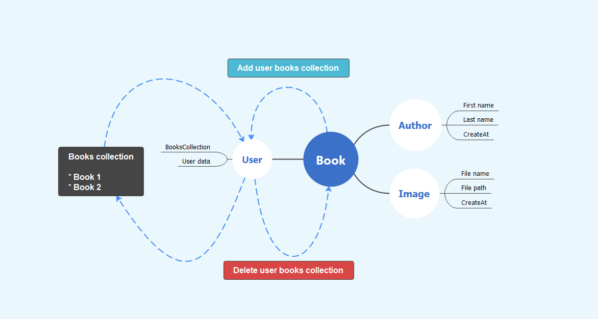

# 📚 Books directory server
This is great server platform to save your favorite books. Also in this server included CRUID standard and Authentication.

## 📦 Packages 
* Express JS Web framework
* Multer and FS packages for working with file system
* Express-Session
* Mongoose 
* MongoDB (database)

## Routes
### Plural routes
Books
```
GET /books
POST /books/new
DELETE /books/delete/<typecode>
```
Authors
```
GET /authors
POST /authors/new
DELETE /authors/delete/<typecode>
```
Users
```
❌ GET /users
POST /users/register
POST /users/login
DELETE /users/logout
POST /users/authchecker
POST /users/user/<typecode>/addbook
POST /users/user/<typecode>/update"
DELETE /users/user/<typecode>/deletebook
```
### Filter
Use ``.`` to access deep properties
```
GET /authors?firstName=Robert Martin
GET /books?title=Clean Code&publishBefore=<typecode>&publishAfter=<typecode>
```

## 💡 Features 
* Register / Login
* Deploy backend
* App register / login
* Logout
* Create and Add book
* Create and Add new author

## 🧲 Relationship Schema collections


